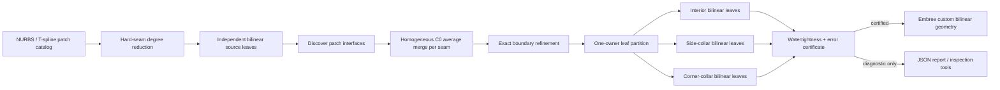

# mfem_raytracing

**Enabling ray tracing on degree-reduced NURBS surfaces** — a C++ library that turns high-order CAD / IGA surfaces into watertight bilinear patches and traces rays against them with Embree.

Developed in the Computational Sciences (CPS) Division at Argonne National Laboratory.

---

## Motivation

Monte Carlo particle transport codes such as [OpenMC](https://docs.openmc.org/) rely on fast ray–surface intersection tests for transport, random-ray methods, homogenization, and visualization. Extending those workflows to **CAD-based geometry** means handling **NURBS**, and the usual options have clear drawbacks:

| Approach | Problem |
| --- | --- |
| Direct ray–NURBS intersection | Too expensive for production transport |
| Fine tessellation into triangles | Primitive counts explode at facility scale |

This library takes a middle path: **degree-reduce each NURBS surface to a watertight mesh of bilinear patches**, then ray-trace those instead. The goal is fewer primitives than a comparable tessellation, without giving up robustness or watertightness — geometries that are built once and ray-traced many times.

On fifth-order test surfaces, a competing + coalesced bilinear reduction has shown **up to ~23× fewer primitives** than curvature-adaptive triangulation at tight error tolerances (generation cost grows as the tolerance tightens).

---

## What this repo provides (C++)

### 1. Curve & surface degree reduction (Piegl–Tiller)

- One-step **B-spline / Bézier / NURBS** curve degree reduction with an error tolerance
- **Multi-step surface reduction** from degree \((p,q)\) down to bilinear \((1,1)\)
- Error-driven **global iso-line splitting** so large patches stay within budget
- **Competing** \(u\)/\(v\) steps against a shared error budget
- **Coalescing**: greedy UV line removal that keeps a conforming tensor grid
- **Hard seams**: original unique knots are never crossed during coalesce, so every leaf is a true \(2\times2\) bilinear (important for multi-span rational surfaces such as a torus)

### 2. Watertight bilinear leaf meshes

- Conforming reduction produces a tensor grid of leaves that share identical edge control data (**C⁰** after corner welding)
- Leaf AABBs and control nets can be exported as JSON for inspection or Embree loading
- Boundary-patch utilities for MFEM NURBS meshes (extract face patches, inspect connectivity)

### 3. Embree ray tracing (optional)

When built with Embree enabled:

- Bilinear patches registered as **custom user geometry** (bounds + intersect + occluded callbacks)
- First-hit and occlusion queries via a small `EmbreeRayTracer` wrapper
- **Multi-hit** continuation (`IntersectAll`): a ray that pierces one patch can keep going and hit others (e.g. front and back of a torus)
- Tools to **render** leaf scenes (PPM) and **export** ray grids for interactive viewers

### 4. Supporting mesh utilities

Cartesian mesh builders and NURBS mesh helpers used by examples and tests.

### 5. T-spline geometric representations

`include/mfem_raytracing/tspline/tspline.hpp` provides a compact implementation of the foundational
representations in Sederberg, Zheng, Bakenov, and Nasri, *T-splines and
T-NURCCs* (2003): rectilinear knot-interval T-meshes, cubic local knot-vector
tracing, PB-spline blending (Eq. 1-4), rational weights, and two-bay
T-junction extension candidates used during cubic Bezier-domain construction.
It intentionally does not claim a complete extraordinary-vertex T-NURCC
refinement algorithm.

For degree-1 T-splines, `ExtractDegreeOneLeaves` converts every T-mesh knot
cell into an exact rational bilinear leaf. `export_tspline_tmesh` writes those
leaves in the same JSON schema used by `LoadLeafPatchScene`,
`render_leaf_patches`, Embree, and `bilinear_ray_tracer.html`; no Embree
primitive changes are required.

`demo_pipe_tspline_leaf_join.py` is the companion multi-patch experiment: it
keeps the original compete+coalesce counts (`n0 + n1`) rather than globally
re-extracting cells. Its JSON stores both the normal Embree-ready `leaves`
array and a `tspline` object with the degree-1 T-mesh/faces/T-junctions.

### Certified multi-patch T-spline shell workflow

The C++ shell workflow joins independently degree-reduced bilinear patches
along a NURBS / T-spline patch catalog, then exports one non-overlapping leaf
set for Embree.  It is intended for app code that needs a clear admission
boundary: a shell is either certified for RT or accompanied by diagnostics
explaining why it is not.



The three emitted leaf roles are deliberately simple:

- **Interior** leaves are unchanged source bilinears away from interfaces.
- **Side-collar** leaves are source boundary cells, exactly split where an
  interface needs additional knots and reseated onto its merged seam curve.
- **Corner-collar** leaves are source corner cells satisfying every incident
  seam together. Their shared projective corner is averaged once, so a corner
  is emitted once rather than once per adjoining interface.

This replaces the older full-pairwise-strip output as the normal export path.
The old construction is still available only as a comparison artifact through
`--compatibility-overlap`; it is not RT-certifiable when its overlapping seam
coverage produces duplicate owners.

The implementation is intentionally split into auditable modules:

| Header / source | Responsibility |
| --- | --- |
| `tspline_patch_interfaces.*` | Discover and orient shared catalog boundaries |
| `tspline_leaf_assembly.*` | Group JSON leaves by source patch and select bands/chains |
| `tspline_average_merge.*` | Rational-safe homogeneous seam averaging |
| `tspline_bilinear_ops.*` | Exact bilinear splitting and projective evaluation |
| `tspline_corner_collar.*` | Disjoint side/corner collar partition and vertex resolution |
| `tspline_shell_watertightness.*` | Source ownership, closed-edge, and manifold checks |
| `tspline_shell_composer.*` | Build orchestration and RT admission gate |
| `tspline_shell_json.*` | Certified shell JSON serialization |

The app-level orchestration entry point is:

```cpp
using namespace mfem_raytracing;
using namespace mfem_raytracing::tspline;

LeafPatchScene leaves = LoadLeafPatchScene("all_patches_0_05.json");
SurfacePatchCatalog catalog = LoadSurfacePatchCatalogJson("pipe_nurbs_border_patches.json");

ShellBuildOptions options;
options.error_validation.maximum_conservative_error = 0.05;
BakedTsplineShell shell = ComposeBakedTsplineShell(leaves, catalog, options);
RequireShellReadyForRayTracing(shell); // throws with a specific failed invariant
```

`BakedTsplineShell` carries the runtime leaves plus its error, ownership, and
watertightness reports.  `RuntimeLeaves()` supplies the final bilinears.  When
Embree is enabled, `EmbreeRayTracer::RegisterLeafPatchScene` also refuses JSON
that declares `certification.rt_certified: false`, unless a diagnostic override
is requested explicitly.

Example command for the direct hard-seam pipe input:

```bash
./build/export_tspline_bilinear_shell \
  --catalog python_experiments/multiple_step_degree_reduction_surfaces/pipe_nurbs_border_patches.json \
  --leaves python_experiments/multiple_step_degree_reduction_surfaces/outputs/all_patches_0_05.json \
  --json out/pipe_rt_shell.json \
  --max-error 0.05
```

On that fixture, the exact collar path emits 2,304 leaves with zero duplicate
owners, open spans, or non-manifold spans; the result is RT-certified.  The
certificate remains the required precondition rather than a promise that every
input catalog has already met these invariants.

---

## Dependencies

| Dependency | Role |
| --- | --- |
| **CMake** ≥ 3.16 | Build |
| **C++17** compiler | Library & tools |
| **[MFEM](https://mfem.org/)** | NURBS meshes and geometry primitives |
| **[Embree](https://www.embree.org/)** 3.6.1+ or 4.x | Optional BVH ray tracing |

Point CMake at your MFEM build with `MFEM_DIR` (defaults to `$HOME/mesh_software/mfem-4.9/build` if that path exists).

---

## Build

```bash
cmake -S . -B build \
  -DMFEM_DIR=/path/to/mfem/build \
  -DMFEM_RAYTRACING_ENABLE_EMBREE=ON \
  -DEMBREE_DIR=/path/to/embree   # optional if Embree is on CMAKE_PREFIX_PATH

cmake --build build -j
ctest --test-dir build          # or: ./build/run_tests  (from the repo root)
```

Embree discovery lives in [`cmake/Embree.cmake`](cmake/Embree.cmake). Omit `-DMFEM_RAYTRACING_ENABLE_EMBREE=ON` for a reduction-only build.

---

## Library layout

| Path | Contents |
| --- | --- |
| `include/mfem_raytracing/reduction/` · `src/reduction/` | Curve/surface degree reduction + leaf extraction |
| `include/mfem_raytracing/tspline/` · `src/tspline/` | T-spline shell composer stack |
| `include/mfem_raytracing/mesh/` · `src/mesh/` | Cartesian / NURBS mesh helpers |
| `include/mfem_raytracing/embree/` · `src/embree/` | Embree tracer, leaf JSON I/O, bilinear intersect |
| `apps/` | CLI tools (`export_*`, `render_*`, `make_cart_mesh`, viewers) |
| `archive/retired/` | Old experiments removed from the live tree |
| `cmake/` | Embree CMake helpers |
| `tests/` | Unit tests (`run_tests`) |
| `meshes/` | Example Cartesian and NURBS meshes |

Principal reduction / tracing headers:

- [`include/mfem_raytracing/reduction/surface_conforming_reduction.hpp`](include/mfem_raytracing/reduction/surface_conforming_reduction.hpp) — watertight multi-step surface reduction + coalesce (+ hard seams)
- [`include/mfem_raytracing/reduction/bilinear_leaf_extraction.hpp`](include/mfem_raytracing/reduction/bilinear_leaf_extraction.hpp) — bilinear leaf collection for BVH / export
- [`include/mfem_raytracing/embree/raytracer.hpp`](include/mfem_raytracing/embree/raytracer.hpp) — Embree scene, `Intersect` / `IntersectAll` / `Occluded`
- [`include/mfem_raytracing/embree/bilinear_intersect.hpp`](include/mfem_raytracing/embree/bilinear_intersect.hpp) — analytic bilinear patch intersection used by Embree callbacks

---

## Useful executables

| Target | Purpose |
| --- | --- |
| `run_tests` | Full unit suite (reduction, meshes, Embree when enabled) |
| `export_bilinear_patches` | Reduce a surface to watertight bilinears and write leaf JSON |
| `export_leaf_bboxes` | Multi-step reduction → leaf AABB JSON (golden-surface demos) |
| `render_leaf_patches` | Embree render of a leaf JSON → shaded / UV / top-down PPM |
| `export_scene_json` | Embree multi-hit ray grid over a leaf scene (for visualization) |
| `export_tspline_bilinear_shell` | Join hard-seam leaves through exact side/corner collars and emit certified RT JSON |
| `tspline_paper_demo` | Reproduces the Fig. 8 local-knot construction and evaluates its T-spline |
| `export_tspline_tmesh` | Evaluates a TSP1 T-mesh and extracts degree-1 T-spline leaves for Embree / HTML |
| `bench_*_degree_reduction` | Curve / surface reduction microbenchmarks |

Example (Embree build):

```bash
# From the repository root so relative mesh/JSON paths resolve
./build/export_bilinear_patches --help
./build/render_leaf_patches path/to/leaves.json out/prefix 512
./build/export_scene_json path/to/leaves.json out/scene.json 24
```

Paper reproduction (no Embree required):

```bash
./build/tspline_paper_demo
# Fig. 8 local s knots: 0 1 2 3 4
# Fig. 8 local t knots: 0 1 2 3 4
# Cubic B(2) = 0.666667
```

---

## Design notes

- **Robustness over remeshing speed.** Bilinear generation can be slower than tessellation at tight tolerances; the payoff is fewer ray-tracing primitives for repeated queries.
- **Watertightness first.** Conforming splits + coalesce + corner welding keep shared leaf edges C⁰. Hard seams prevent multi-span “fake” degree-1 nets on surfaces with interior knots.
- **Bridge to IGA.** The same leaf representation is a natural substrate for ray tracing on isogeometric meshes, not only CAD shells.

---

## References

1. Piegl, L., & Tiller, W. (1997). *The NURBS Book* (2nd ed.). Springer.
2. Sederberg, T. W., Zheng, J., Bakenov, A., & Nasri, A. (2003). *T-splines and T-NURCCs*. ACM TOG 22(3), 477-484.
3. Intel Embree — [https://www.embree.org/](https://www.embree.org/)
4. MFEM — [https://mfem.org/](https://mfem.org/)

---

## License / status

Research / internship prototype for CAD ↔ Monte Carlo ray-tracing workflows. See repository metadata for license and citation details as they are published.
