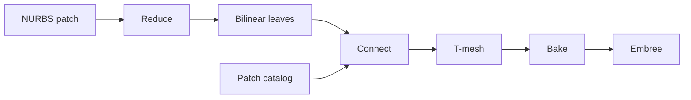

# mfem_raytracing

**Ray tracing on degree-reduced NURBS** — turn high-order CAD / IGA surfaces into
watertight bilinear patches, then trace them with Embree.

Developed in the Computational Sciences (CPS) Division at Argonne National Laboratory.

Engineering knobs, viewer capabilities, and performance notes live in
[`experiments/IMPROVEMENTS.md`](experiments/IMPROVEMENTS.md).

---

## Motivation

Monte Carlo codes such as [OpenMC](https://docs.openmc.org/) need fast ray–surface
tests. For CAD / NURBS geometry the usual choices are costly:

| Approach | Drawback |
| --- | --- |
| Direct ray–NURBS | Too expensive for production transport |
| Fine triangle tessellation | Primitive counts explode at facility scale |

This library takes a middle path: **degree-reduce each NURBS surface to a
watertight mesh of bilinear patches**, then ray-trace those. Build once, query
many times — typically fewer primitives than a comparable tessellation at the
same geometric error.

On fifth-order test surfaces, competing + coalesced bilinear reduction has shown
**up to ~23× fewer primitives** than curvature-adaptive triangulation at tight
tolerances.

---

## What you get

1. **Degree reduction** (Piegl–Tiller) for curves and surfaces down to bilinear
   \((1,1)\), with hard seams so multi-span leaves stay true \(2\times2\) patches.
2. **Watertight leaf meshes** — conforming UV grids, C⁰ shared edges, JSON export.
3. **Optional Embree tracing** — custom bilinear geometry, first-hit, occlusion,
   and multi-hit continuation (e.g. front and back of a shell).
4. **Multi-patch T-spline bake** — join independently reduced patches along catalog
   seams into one certified (or diagnostic) RT leaf set.

---

## Pipeline (Reduce → Connect → T-mesh → Bake)



| Stage | Entry point |
| --- | --- |
| Reduce | `ReducePatchToBilinearLeaves` / `ReducePatchesToBilinearLeaves` |
| Connect | `ConnectPatchLeaves` |
| T-mesh | `BuildMultiPatchTMesh` |
| Bake | `BakeForRayTracing` |

```cpp
#include "mfem_raytracing/mfem_raytracing.hpp"

using namespace mfem_raytracing;
using namespace mfem_raytracing::tspline;

LeafPatchScene leaves = LoadLeafPatchScene("all_patches_0_05.json");
SurfacePatchCatalog catalog = LoadSurfacePatchCatalogJson("pipe_nurbs_border_patches.json");

ShellBuildOptions options;
options.error_validation.maximum_conservative_error = 0.05;

SeamAssembly assembly = ConnectPatchLeaves(leaves, catalog, options);
MultiPatchTMesh tmesh = BuildMultiPatchTMesh(std::move(assembly));
RtLeafScene shell = BakeForRayTracing(tmesh);
RequireShellReadyForRayTracing(shell);
```

Hard-seam reduce + bake from the CLI:

```bash
./build/export_hard_seam_patches \
  --catalog tests/test-jsons/pipe_nurbs_border_patches.json \
  --patches 0-15 --max-error 0.05 \
  --json out/pipe_leaves.json

./build/export_tspline_bilinear_shell \
  --catalog tests/test-jsons/pipe_nurbs_border_patches.json \
  --leaves out/pipe_leaves.json \
  --json out/pipe_rt_shell.json \
  --max-error 0.05
```

A certified shell has a one-owner leaf partition (interior + side/corner collars)
and passes watertightness / error checks. Open shells (e.g. classic teapot) may
only export as diagnostic JSON — see the improvements doc.

---

## Dependencies

| Dependency | Role |
| --- | --- |
| **CMake** ≥ 3.16 | Build |
| **C++17** | Library & tools |
| **[MFEM](https://mfem.org/)** | NURBS meshes |
| **[Embree](https://www.embree.org/)** 3.6.1+ or 4.x | Optional ray tracing |

Set `MFEM_DIR` to your MFEM build (defaults to `$HOME/mesh_software/mfem-4.9/build`
when that path exists).

---

## Build

```bash
cmake -S . -B build \
  -DMFEM_DIR=/path/to/mfem/build \
  -DMFEM_RAYTRACING_ENABLE_EMBREE=ON \
  -DEMBREE_DIR=/path/to/embree   # if not already on CMAKE_PREFIX_PATH

cmake --build build -j
ctest --test-dir build
```

Omit `-DMFEM_RAYTRACING_ENABLE_EMBREE=ON` for a reduction-only build.
Embree discovery: [`cmake/Embree.cmake`](cmake/Embree.cmake).

Interactive Embree lab (SDL2 build):

```bash
./build-embree-test/embree_surface_lab path/to/leaves.json
```

More viewer / STEP / memory / benchmark detail:
[`experiments/IMPROVEMENTS.md`](experiments/IMPROVEMENTS.md).

---

## Layout

| Path | Contents |
| --- | --- |
| `include/mfem_raytracing/` · `src/` | Library (pipeline, reduction, tspline, embree, mesh) |
| `apps/` | CLI tools and viewers |
| `tests/` · `tests/test-jsons/` | Unit tests and fixtures |
| `python_experiments/` | Prototypes, STEP ingest, demos |
| `experiments/` | Capabilities & engineering notes |
| `meshes/` | Example Cartesian / NURBS meshes |

---

## Useful tools

| Target | Purpose |
| --- | --- |
| `run_tests` | Unit suite |
| `export_hard_seam_patches` | Catalog → independent bilinear leaves |
| `export_tspline_bilinear_shell` | Leaves → certified / diagnostic RT shell |
| `export_bilinear_patches` | Single-surface watertight bilinears |
| `render_leaf_patches` | Embree PPM render |
| `embree_surface_lab` | Interactive Embree viewer |
| `tspline_paper_demo` | Fig. 8 local-knot check (no Embree) |

```bash
./build/render_leaf_patches path/to/leaves.json out/prefix 512
./build/tspline_paper_demo
```

---

## Design notes

- **Robustness over remesh speed.** Generation can be slower than tessellation at
  tight tolerances; the payoff is fewer RT primitives for repeated queries.
- **Watertightness first.** Conforming splits, coalesce, and collar baking keep
  shared edges C⁰ where the certificate requires it.
- **IGA bridge.** The same leaf representation suits isogeometric meshes, not
  only CAD shells.

---

## References

1. Piegl, L., & Tiller, W. (1997). *The NURBS Book* (2nd ed.). Springer.
2. Sederberg, T. W., Zheng, J., Bakenov, A., & Nasri, A. (2003). *T-splines and T-NURCCs*. ACM TOG 22(3), 477–484.
3. Intel Embree — https://www.embree.org/
4. MFEM — https://mfem.org/

---

## License / status

Research / internship prototype for CAD ↔ Monte Carlo ray-tracing workflows.
See repository metadata for license and citation as they are published.
